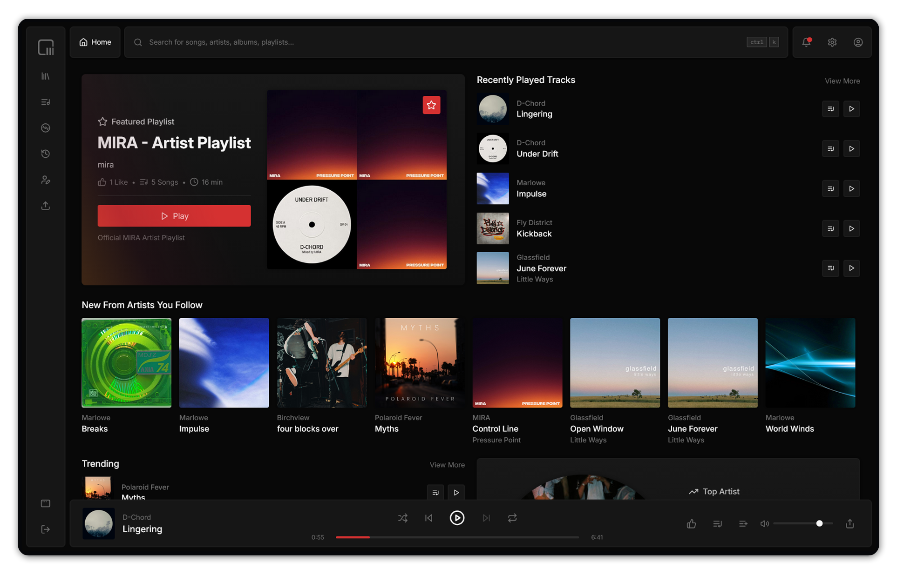

# CoogMusic

CoogMusic is a full-stack music streaming application built with React, Node.js, and PostgreSQL.

- [Website](https://cosc-3380.azurewebsites.net)
- [GitHub Repository](https://github.com/k0src/COSC-3380-Project)

> Team 8 GitHub Usernames:
>
> - Joshua- `joshngu`
> - Koren - `k0src`
> - Ron - `ron-alex`
> - Santiago- `marujpree`
> - Shamake - `musa20`



## Tech Stack

- **Client**:
  - [React](https://react.dev), [TypeScript](https://www.typescriptlang.org), [Vite](https://vitejs.dev)
- **Server**:
  - [Node.js](https://nodejs.org), [Express](https://expressjs.com), [TypeScript](https://www.typescriptlang.org)
- **Database**:
  - [PostgreSQL](https://www.postgresql.org)
- **Deployment**:
  - [Azure App Service](https://azure.microsoft.com/products/app-service/), [Azure Database for PostgreSQL](https://azure.microsoft.com/products/postgresql/)

## Features

- User authentication (sign-up, login, logout)
- Browse user-generated music library, including songs, albums, and playlists
- Create and manage playlists
- Social interactions: like and comment on songs, follow artists, and view follower/following lists
- User notifications for likes, follows, comment mentions, and more
- Persistent, dynamic audio queue; queue and play songs seamlessly; queue sessions are saved over reloads
- Comprehensive user settings, including dynamic theming options
- Automatic duplicate song detection: identifies and prevents duplicate song uploads based on waveform data
- Search functionality for songs, albums, artists, and playlists
- In-depth artist dashboard for song and album management, including upload, edit, and delete capabilities
- Artist audience engagement features, such as artist profile customization, featured artist playlists, and profile album pins.

## Development

Follow these instructions to get a copy of the project up and running on your local machine.

### Clone the Repository

Open your terminal and navigate to your desired directory. Then run:

```bash
git clone https://github.com/k0src/COSC-3380-Project.git
cd COSC-3380-Project
```

to clone the repository and navigate into the project directory.

### Installation

The project consists of a **client** and a **server**. You must install dependencies for both.

In the project root directory, run:

```bash
npm run install:all
```

This installs the dependencies for both the client and server. If you prefer, you can navigate into each directory (`client` and `server`) and run `npm install` individually:

```
cd client
npm install

cd ../server
# The react-helmet-async package is out-of-date with the latest version of React:
npm install --legacy-peer-deps
```

### Environment Variables

#### Client Configuration

1. Create a `.env` file in the `client` directory.
2. Add the following environment variables to the `.env` file:

```
# Set the mode to development
VITE_MODE=development
# Set the API URL to point to the local server where the PostgreSQL database is hosted
VITE_API_URL=http://localhost:8080/api
```

#### Server Configuration

1. Create a `.env` file in the `server` directory.
2. Add the following environment variables to the `.env` file:

```
# Development mode
NODE_ENV=development

# Server configuration
PORT=8080
HOST=localhost
CLIENT_URL=http://localhost:5173
CLIENT_PORT=5173

# Database configuration
PGHOST=your_database_host
PGPORT=5432 # Default PostgreSQL port
PGUSER=your_database_user
PGPASSWORD=your_database_password
PGDATABASE=your_database_name
PGPOOLSIZE=10
PGSSLMODE=require

# Blob Storage
AZURE_STORAGE_CONNECTION_STRING="your_connection_string"
AZURE_STORAGE_ACCOUNT="your_account_name"
AZURE_STORAGE_ACCOUNT_KEY="your_account_key"
AZURE_STORAGE_CONTAINER="uploads"
SAS_TOKEN_DURATION=3600

# Security
BCRYPT_ROUNDS=12
CORS_ORIGIN=http://localhost:5173 # Default client URL

# Rate limiting
RATE_LIMIT_WINDOW_MS=900000
RATE_LIMIT_MAX_REQUESTS=100

# JWT Configuration
JWT_SECRET=your_jwt_secret
JWT_EXPIRES_IN=24h
JWT_REFRESH_SECRET=your_jwt_refresh_secret
JWT_REFRESH_EXPIRES_IN=7d

API_URL=http://localhost:8080/api
```

### Running the Application

To start both the client and server, run the following command from the project root directory:

```bash
npm run dev
```

This will start the server on `http://localhost:8080` and the client on `http://localhost:5173`.

Alternatively, you can start the client and server separately:

1. Start the server:
   ```bash
   cd server
   npm run dev
   ```
2. Start the client:
   ```bash
   cd client
   npm run dev
   ```

### Building the Application

To build both the client and server for production, run the following command from the project root directory:

```bash
npm run build
```

This will run the `build.js` script located in the `scripts` directory, which does the following:

1. Runs `npm install` in the server directory to install all dependencies.
2. Runs `npm run build` in the server directory to build the server.
3. Runs `npm install` in the client directory to install all dependencies.
4. Runs `npm run build` in the client directory to build the client.
5. Copies the built client files into the server's `public` directory for serving.
6. Creates a deployment package in the `server/dist` directory.

#### Building the Standalone Application

To build the standalone application using Tauri, navigate to the `client` directory and run:

```bash
npm run tauri:build
```

This will create a standalone application in the `client/src-tauri/target/release` directory.

Note: Ensure you have Tauri prerequisites installed. Refer to the [Tauri documentation](https://tauri.app/v1/guides/getting-started/prerequisites) for more information. You can also run the standalone application in development mode with:

```bash
npm run tauri:dev
```
